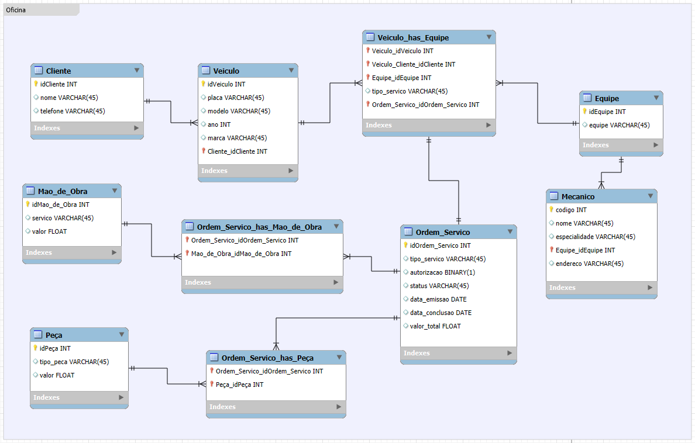

# SQL

## Sobre o projeto

- desenvolvimento_web/*semana_06_POO*:
  - ➡️ Exercício de modelagem mental e analítica.

  - O objetivo é:
    - Pensar como arquiteto de dados
    - Definir a entidade de forma consistente
    - Traduzir o código (POO) para o mundo relacional

- desenvolvimento_web/*semana_07*
  - ➡️ Desafio sobre modelagem de E-commerce
  - O objetivo é:
    - Refine o modelo apresentado acrescentando os seguintes pontos:
      - Cliente PJ e PF – Uma conta pode ser PJ ou PF, mas não pode ter as duas informações;
      - Pagamento – Pode ter cadastrado mais de uma forma de pagamento;
      - Entrega – Possui status e código de rastreio;
  
  - ➡️ Desafio é sobre criar um esquema conceitual do zero.
  - O objetivo é:
    - Cria o esquema conceitual para o contexto de oficina com base na narrativa fornecida;
    - Narrativa:
      - Sistema de controle e gerenciamento de execução de ordens de serviço em uma oficina mecânica;
      - Clientes levam veículos à oficina mecânica para serem consertados ou para passarem por revisões  periódicas;
      - Cada veículo é designado a uma equipe de mecânicos que identifica os serviços a serem executados e preenche uma OS com data de entrega;
      - A partir da OS, calcula-se o valor de cada serviço, consultando-se uma tabela de referência de mão-de-obra;
      - O valor de cada peça também irá compor a OSO cliente autoriza a execução dos serviços;
      - A mesma equipe avalia e executa os serviços;
      - Os mecânicos possuem código, nome, endereço e especialidade e
      - Cada OS possui: n°, data de emissão, um valor, status e uma data para conclusão dos trabalhos.

## Layout

## Competências

- Modelagem entidade-relacionamento
