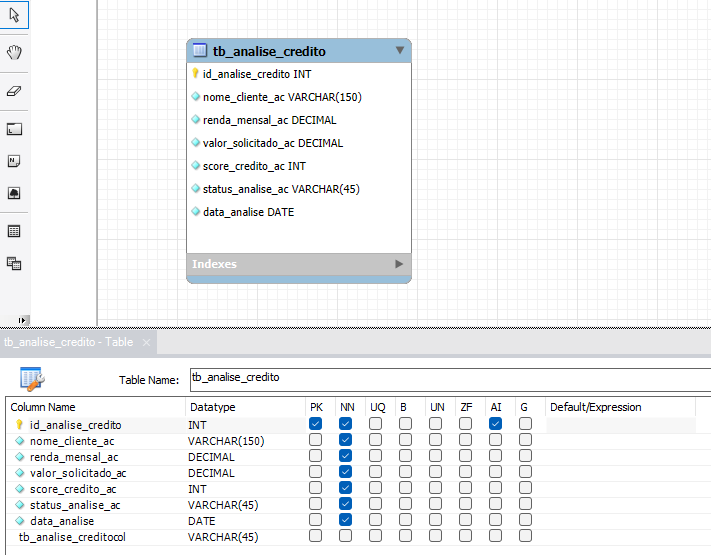

# SQL

## Sobre o projeto

- desenvolvimento_web/*semana_06_POO*:
  - ➡️ Exercício de modelagem mental e analítica.

  - O objetivo é:
    - Pensar como arquiteto de dados
    - Definir a entidade de forma consistente
    - Traduzir o código (POO) para o mundo relacional

## Layout

## Competências

- Modelagem entidade-relacionamento
