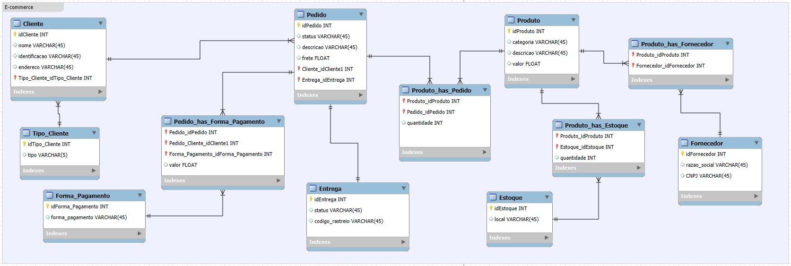

# SQL

## Sobre o projeto

- desenvolvimento_web/*semana_06_POO*:
  - ➡️ Exercício de modelagem mental e analítica.

  - O objetivo é:
    - Pensar como arquiteto de dados
    - Definir a entidade de forma consistente
    - Traduzir o código (POO) para o mundo relacional

- desenvolvimento_web/*semana_07*
  - ➡️ Desafio sobre modelagem de E-commerce
  - O objetivo é:
    - Refine o modelo apresentado acrescentando os seguintes pontos:
      - Cliente PJ e PF – Uma conta pode ser PJ ou PF, mas não pode ter as duas informações;
      - Pagamento – Pode ter cadastrado mais de uma forma de pagamento;
      - Entrega – Possui status e código de rastreio;

## Layout

## Competências

- Modelagem entidade-relacionamento
